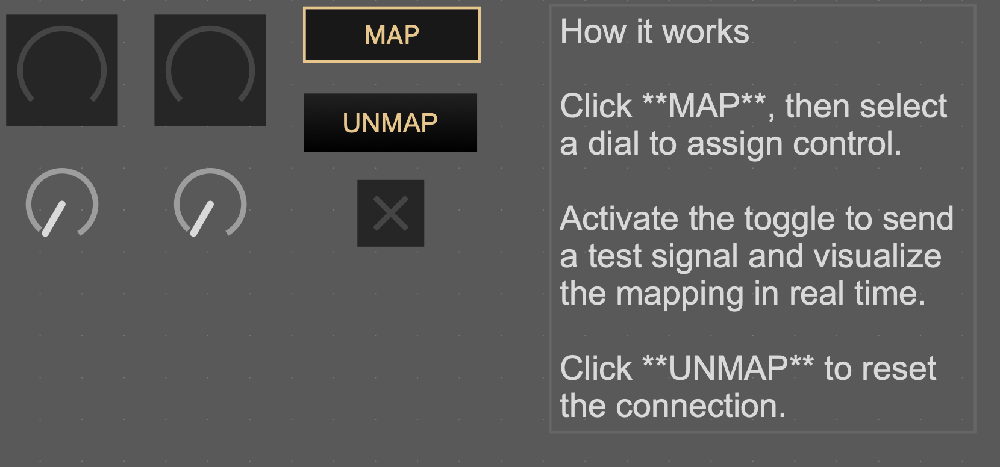

# Interactive Parameter Mapping Tool (Max/MSP) 

## Status

Early prototype 1.7

## Overview

An interactive parameter mapping tool inspired by DAW workflows, allowing users to assign controls to parameters through direct interaction.

This project focuses on interaction design and control mapping rather than sound generation.

## How it works

Click **MAP**, then select a dial to assign control.  
Activate the toggle to send a test signal and visualize the mapping in real time.  
Click **UNMAP** to reset the connection.

## Demo

Watch a short demo here:  
https://www.youtube.com/watch?v=GdX3omNdnD8

This video demonstrates an interactive parameter mapping tool built in Max/MSP.

It allows users to assign controls to parameters through direct interaction, without using send/receive objects, inspired by DAW mapping workflows.

## Features

- Click-to-map parameter assignment
- Real-time control routing
- Flexible mapping between inputs and parameters

## Purpose

This tool was designed to explore:
- User interaction in mapping systems
- Control abstraction and parameter routing
- Expressive performance workflows

## Context

This project is part of a broader interest in gesture-to-sound mapping and digital instrument design.

## Possible Improvements

- Visual feedback for mappings
- Preset storage / recall
- Multi-parameter mapping

## Requirements

- Max/MSP
